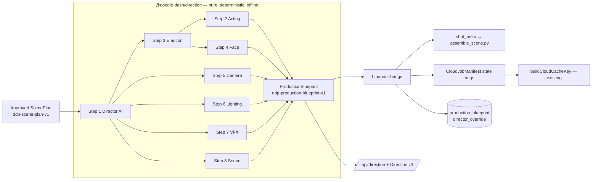

# DDP Steps 1–8 — Production Excellence Architecture

TivvleJoy Studios production-excellence tranche. Reusable, deterministic, testable
production **capability** — not Season 1 content.

Starting commit: `1ff46d595023ede5a33aa9e7f12cbbebe5ec9ed1` (canonical branch,
FINAL_1080P acceptance CLOSED and preserved).

---

## 1. What was already here (audit result)

The audit found a substantial existing studio, and the eight steps are extensions of
it rather than a new stack. The relevant existing seams:

| Existing thing | Where | How Steps 1–8 use it |
| --- | --- | --- |
| `Episode → Scene → Shot` (Prisma) | `packages/database/prisma/schema.prisma` | Blueprint references shots; nothing renamed |
| `ShotAnimationPackage` (versioned JSON per shot) | same | Blueprint projection can populate it; not replaced |
| `CloudJobManifest` with empty `cameraState` / `lightingState` / `vfxState` / `expressionStates` / `visemeData` bags | `packages/production/src/cloud/types.ts` | The eight systems finally **fill** these bags |
| `buildCloudCacheKey()` already hashes those bags | `packages/production/src/cloud/cloud-cache.ts` | Blueprint output therefore participates in cache invalidation for free |
| `shot_meta` JSON consumed by Blender | `scripts/blender/assemble_scene.py` | Blueprint projects to `shotMeta`; new keys are strictly opt-in |
| `LIGHTING_STATES`, `configure_camera()`, `apply_action()`, `apply_viseme_cues()` | same | Lighting/camera/acting/face plans resolve **to** these, never around them |
| `install_shadow_proxy()` — the chest seam repair | same | Untouched. Facial planning is bounded so it cannot reach it |
| `RenderProvider` + `LocalBlenderProvider` / `RunpodBlenderProvider` | `packages/production/src/cloud/render-provider.ts` | Untouched; blueprint is provider-agnostic |
| `CloudCostGuardrails`, `verifyWorkerProvenance()` | `packages/production/src/cloud/` | Untouched; blueprint cost estimates are advisory and never authorize spend |
| Vitest suite in `apps/web/src/lib/*.test.ts` | `apps/web` | New tests follow the same convention |

Two things the audit proved were **absent** and had to be created rather than
extended: a typed production blueprint, and canonical voice identities
(`pip_default_v1` / `goat_default_v1` existed nowhere in the repo).

## 2. Shape of the change



The eight systems live in one new workspace package, `@doodle-dash/direction`, and
are **pure functions**: no database, no filesystem, no network, no clock. That is a
deliberate architectural constraint, and it is what makes determinism testable, the
suite fast, and "no paid provider required to run tests" true by construction.
Everything that touches the world (Prisma, R2, Blender, FFmpeg) stays in the
packages that already own it.

### Package layout

```
packages/direction/src/
├── determinism.ts     seeded PRNG, stable stringify, seed derivation, hashing
├── versions.ts        SUBSYSTEM_VERSIONS — every system's version in one place
├── locks.ts           Pip/Goat canon + voice locks; fail-closed validation
├── schema/
│   ├── common.ts      shared primitives (character codes, bounded ranges)
│   ├── scene-plan.ts  ddp-scene-plan-v1 (input contract)
│   ├── blueprint.ts   ddp-production-blueprint-v1 (output contract)
│   └── migrations.ts  versioned migration registry + upgradeBlueprint()
├── emotion/           Step 3
├── acting/            Step 2
├── face/              Step 4
├── camera/            Step 5
├── lighting/          Step 6
├── vfx/               Step 7
├── sound/             Step 8
├── director/          Step 1 — composes all of the above
├── bridge.ts          projection into shot_meta + CloudJobManifest state bags
├── ffmpeg.ts          sound plan → FFmpeg argv (pure string building)
├── overrides.ts       human overrides + override provenance
├── cache.ts           cache keys, targeted invalidation
├── fixtures.ts        regression fixtures + the local validation scene
└── index.ts
```

### Determinism

Nondeterminism is confined to one module. `deriveSeed(rootSeed, ...path)` produces a
stable 32-bit seed from a hash of the path, and `createRng(seed)` is a mulberry32
PRNG. Every subsystem that makes a "choice" draws from a seed derived from
(`rootSeed`, shot id, subsystem name), so:

- identical input plus identical configuration produces byte-identical output;
- changing shot 3 does not perturb shot 4's choices;
- no wall-clock time, `Math.random`, `Date.now`, or object-iteration order reaches
  a hashed field. Timestamps live in a `meta` envelope that is explicitly excluded
  from both the content hash and the cache key.

### Cache keys and targeted invalidation

Two levels, both hash-stable:

- `shotCacheKey` — per shot, over everything that can change that shot's pixels or
  audio: its blueprint content plus the subsystem versions that produced it.
- `blueprintCacheKey` — over the episode-level delivery contract plus the ordered
  list of shot cache keys.

Because the bridge writes blueprint state into the manifest bags that
`buildCloudCacheKey()` already hashes, a lighting tweak invalidates exactly the shots
whose lighting changed and nothing else. `diffBlueprints()` reports that directly, and
the validation harness proves it.

### Fail-closed posture

Every system returns issues with a severity, and `ERROR`-severity issues make the
blueprint `validation.status === 'FAIL'`. There is no silent fallback to generic
direction: a beat the director cannot resolve produces an error, not a shrug.
Character-lock and voice-lock violations are always `ERROR`.

## 3. Character and voice locks

`packages/direction/src/locks.ts` holds the canonical locks as data:
`CHAR_PIP_001` / `CHAR_GOAT_001`, their anatomy, colours, accessories, personality,
age presentation, and permanent voice identities `pip_default_v1` /
`goat_default_v1`. Every subsystem output is checked against the lock before the
blueprint is returned. Facial and acting plans additionally carry per-character
deformation ceilings so no plan can ask for Pip's beak or Goat's horns to move
outside tolerance.

The locks are *assertions about plans*, not edits to assets. Nothing in this tranche
writes to `production-library/`.

## 4. Brand transition

Centralized in `packages/domain/src/brand.ts`. Product-facing name becomes
**TivvleJoy Studios**; every internal identifier keeps its value:

| Kept exactly as-is | Reason |
| --- | --- |
| `PRODUCT_DISPLAY_NAME = 'Doodle Dash Production'` | `universe.brandName` in existing rows and asserted by existing tests |
| `DEFAULT_UNIVERSE_NAME = 'Doodle Dash Universe'` | in-fiction canon, seeded, referenced by canon facts |
| `Doodle Dash TV` channel | explicitly out of scope |
| `DDP_*` env vars, image labels, `ddp-cloud-job-manifest-v1`, `DDP_` stdout prefixes, R2 prefixes, `production-library/` paths | changing any of these breaks historical artifacts or the provenance chain |

`resolveStudioDisplayName()` maps legacy stored brand names onto the new display name
so existing projects show TivvleJoy Studios without a data migration. See
`docs/BRAND_COMPATIBILITY.md`.

## 5. Persistence

One additive migration, `20260813190000_ddp_steps_1_8_direction_layer`: two new
tables (`production_blueprints`, `director_overrides`). No column is dropped, renamed,
or retyped; no existing row is rewritten. Rolling back is dropping two tables.

`episode_id` is TEXT rather than a foreign key to `episodes`. A blueprint is planned
from an approved scene plan, which names its episode logically, and planning has to be
possible before an Episode row exists — constraining it would make the planning layer
depend on production state it is supposed to precede.

## 6. Risk register

| # | Risk | Severity | Mitigation |
| --- | --- | --- | --- |
| R1 | A camera/lighting/VFX change silently alters the accepted FINAL_1080P look | High | All new `shot_meta` keys are opt-in; absent keys reproduce current behaviour byte-for-byte. Regression test asserts the accepted Meadow Map Mystery `shot_meta` projection is unchanged |
| R2 | Facial planning reaches the shadow-caster and reopens the chest seam | High | No Python shadow-caster code is modified. Facial plans are bounded by character-lock tolerances and cannot emit shape-key targets outside the approved viseme/expression vocabulary. `assemble_scene.py` shadow constants asserted unchanged by test |
| R3 | Approved assets modified | High | Asset fingerprint `7876ac73…` asserted in tests; nothing writes to `production-library/` |
| R4 | Rebrand breaks DB/manifest compatibility | Medium | Internal names unchanged by value; legacy-load tests |
| R5 | New subsystem state not in cache key → stale renders | Medium | Bridge writes into the bags `buildCloudCacheKey()` already hashes; explicit cache-key tests, including a "every output-affecting field changes the key" test |
| R6 | Nondeterminism creeps in | Medium | Single PRNG module; determinism tests hash whole blueprints across repeated runs; no clock in hashed content |
| R7 | Destructive migration | Medium | Additive-only, two new tables |
| R8 | A test needs Blender, Postgres-only features, or a paid provider | Medium | Direction package is pure and Blender-free; Blender step of the validation harness is optional and reports `SKIPPED` when Blender is absent |
| R9 | Acceptance thresholds weakened to make new scenes pass | High | No existing gate threshold is edited. New lighting/VFX thresholds ship with both accepted and deliberately-rejected fixtures |
| R10 | Cost estimates mistaken for authorization | Medium | Estimates are advisory; the paid-launch gate remains `CloudCostGuardrails` + `ALLOW_PAID_GPU_LAUNCH`, untouched |

## 7. Regression fixtures

Taken from committed, already-accepted evidence — no new renders:

- `artifacts/final-1080p-seam-confirm/accept1080-2026-08-13T18-02-48-636Z/` — accepted
  artifact hash `aefdd0b0…`, worker digest `sha256:8204d4bf…`.
- The accepted Meadow Map Mystery composition (`PUSH_IN`, `DAY_KEY`, `PIP_POINT`,
  `GOAT_HEAD_NOD`, the placement coordinates in `scripts/assets/scene_gates.py`) is
  pinned as a **regression fixture**, explicitly not as a mandatory composition for
  future shots.
- Character-lock evidence from `docs/CHARACTERS/PIP.md` / `GOAT.md`.

## 8. Stop conditions checked before implementing

| Condition | Result |
| --- | --- |
| Starting commit matches | Yes — `1ff46d5` |
| Canonical branch clean beyond `artifacts/acceptance-1080p/` | Yes |
| Existing tests pass before changes | Yes — 183 passed / 17 files; typecheck and lint clean |
| Approved character assets need modification | No |
| Secret or paid service required | No |
| Cloud GPU would launch | No |
| Acceptance thresholds need weakening | No |
| `production-library/` needs modification | No |
| Destructive migration necessary | No |
| Backward compatibility preservable | Yes |

Blender is **not installed** in this environment, so Blender-dependent gates
(`test:blender`, `gates:scene`, `qc:caster`) cannot execute here. They are unchanged
and their prior committed results remain valid; the validation harness reports the
Blender stage as `SKIPPED` rather than claiming a pass.

## 9. What changed after implementation

Three things the plan above did not anticipate, recorded because they are the parts a
reviewer would otherwise have to rediscover:

1. **The render-code fingerprint moved.** The opt-in `apply_direction_camera()` hook in
   `assemble_scene.py` changed the fingerprint from `a4018c0e…` to `d3820820…`, so the
   published worker image is now stale and preflight fails closed with
   `RENDER_CODE_MISMATCH`. The pin was deliberately left alone — re-pinning would claim
   the image contains code it does not — and a test asserts the refusal. A rebuild and
   re-pin is required before the next authorized paid launch. The approved asset
   fingerprint `7876ac73…` is unchanged, so the accepted artifact is unaffected.
2. **Loudness normalisation had to become two-pass.** Single-pass `loudnorm` is adaptive
   and cannot converge on a 2.5-second shot; mixes came out up to 2.8 LU hot. Measuring
   first and applying one fixed linear correction is both accurate and deterministic.
3. **`episode_id` is not a foreign key.** See §5.

Working guide: [`DDP_STEPS_1_8.md`](DDP_STEPS_1_8.md). Brand policy:
[`BRAND_COMPATIBILITY.md`](BRAND_COMPATIBILITY.md).
