# Theatrical foundation visual previews

These stills are for Justin’s review. Automated tests passing does **not** approve them.

| File | Label | Subject |
| --- | --- | --- |
| `artifacts/theatrical-foundation/previews/existing_approved_pip_front.png` | existing approved asset | pip |
| `artifacts/theatrical-foundation/previews/existing_approved_pip_left.png` | existing approved asset | pip |
| `artifacts/theatrical-foundation/previews/existing_approved_pip_right.png` | existing approved asset | pip |
| `artifacts/theatrical-foundation/previews/existing_approved_pip_rear.png` | existing approved asset | pip |
| `artifacts/theatrical-foundation/previews/existing_approved_pip_closeup.png` | existing approved asset | pip |
| `artifacts/theatrical-foundation/previews/existing_approved_pip_full_body.png` | existing approved asset | pip |
| `artifacts/theatrical-foundation/previews/existing_approved_pip_three_quarter_pip_point.png` | existing approved asset | pip |
| `artifacts/theatrical-foundation/previews/existing_approved_goat_front.png` | existing approved asset | goat |
| `artifacts/theatrical-foundation/previews/existing_approved_goat_left.png` | existing approved asset | goat |
| `artifacts/theatrical-foundation/previews/existing_approved_goat_right.png` | existing approved asset | goat |
| `artifacts/theatrical-foundation/previews/existing_approved_goat_rear.png` | existing approved asset | goat |
| `artifacts/theatrical-foundation/previews/existing_approved_goat_closeup.png` | existing approved asset | goat |
| `artifacts/theatrical-foundation/previews/existing_approved_goat_full_body.png` | existing approved asset | goat |
| `artifacts/theatrical-foundation/previews/existing_approved_goat_three_quarter_goat_head_nod.png` | existing approved asset | goat |
| `artifacts/theatrical-foundation/previews/existing_approved_meadow_set.png` | existing approved asset | meadow_set |
| `artifacts/theatrical-foundation/previews/existing_approved_map_prop.png` | existing approved asset | map_prop |
| `artifacts/theatrical-foundation/previews/proposed_upgrade_pip_front.png` | proposed upgrade | pip |
| `artifacts/theatrical-foundation/previews/proposed_upgrade_goat_front.png` | proposed upgrade | goat |
| `artifacts/theatrical-foundation/previews/proposed_upgrade_pip_closeup.png` | proposed upgrade | pip |
| `artifacts/theatrical-foundation/previews/proposed_upgrade_goat_closeup.png` | proposed upgrade | goat |
| `artifacts/theatrical-foundation/previews/proposed_upgrade_pip_full_body.png` | proposed upgrade | pip |
| `artifacts/theatrical-foundation/previews/proposed_upgrade_goat_full_body.png` | proposed upgrade | goat |
| `artifacts/theatrical-foundation/previews/proposed_upgrade_pip_closeup_motivated.png` | proposed upgrade | pip |
| `artifacts/theatrical-foundation/previews/proposed_upgrade_goat_closeup_motivated.png` | proposed upgrade | goat |
| `artifacts/theatrical-foundation/previews/proposed_upgrade_meadow_set.png` | proposed upgrade | meadow_set |
| `artifacts/theatrical-foundation/previews/proposed_upgrade_map_prop.png` | proposed upgrade | map_prop |
| `artifacts/theatrical-foundation/previews/proposed_upgrade_vertical_scene_meadow.png` | proposed upgrade | vertical-scene |
| `artifacts/theatrical-foundation/previews/diagnostic_pip_front.png` | temporary diagnostic asset | pip |

## Gallery

### existing approved asset — existing_approved_pip_front.png

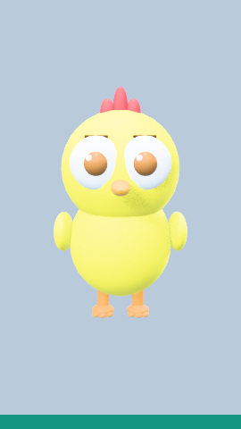

### existing approved asset — existing_approved_pip_left.png

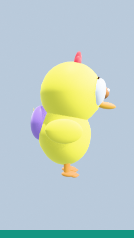

### existing approved asset — existing_approved_pip_right.png

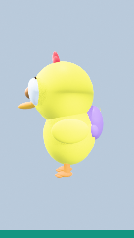

### existing approved asset — existing_approved_pip_rear.png

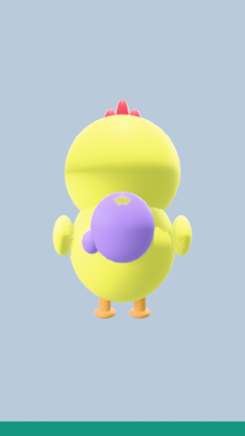

### existing approved asset — existing_approved_pip_closeup.png

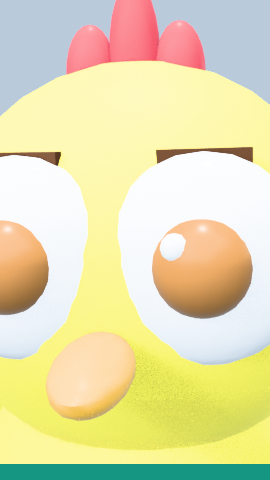

### existing approved asset — existing_approved_pip_full_body.png

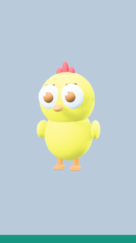

### existing approved asset — existing_approved_pip_three_quarter_pip_point.png

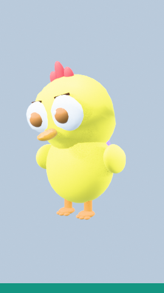

### existing approved asset — existing_approved_goat_front.png

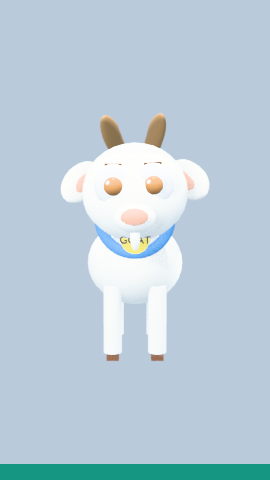

### existing approved asset — existing_approved_goat_left.png

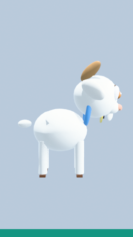

### existing approved asset — existing_approved_goat_right.png

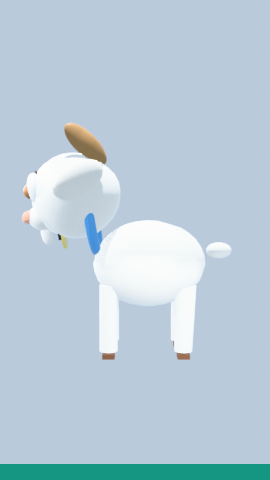

### existing approved asset — existing_approved_goat_rear.png

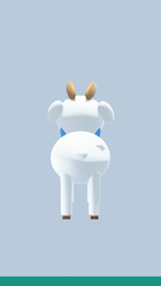

### existing approved asset — existing_approved_goat_closeup.png

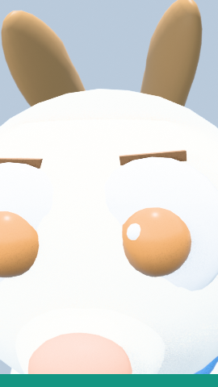

### existing approved asset — existing_approved_goat_full_body.png

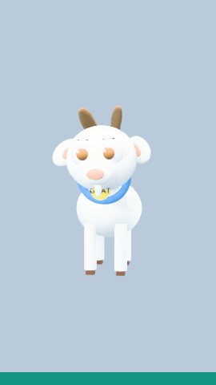

### existing approved asset — existing_approved_goat_three_quarter_goat_head_nod.png

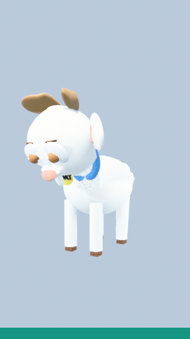

### existing approved asset — existing_approved_meadow_set.png

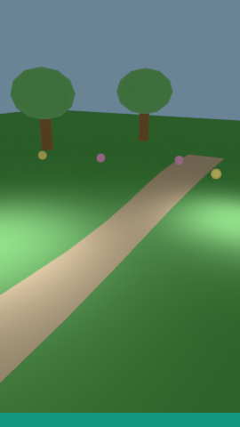

### existing approved asset — existing_approved_map_prop.png

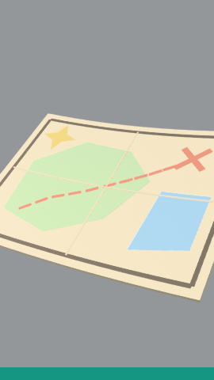

### proposed upgrade — proposed_upgrade_pip_front.png

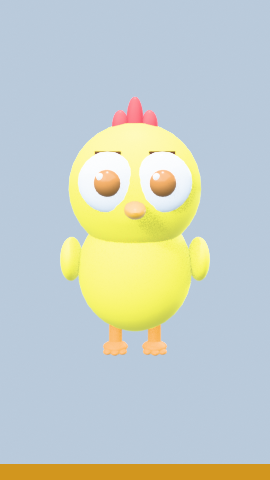

### proposed upgrade — proposed_upgrade_goat_front.png

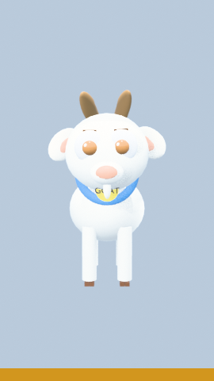

### proposed upgrade — proposed_upgrade_pip_closeup.png

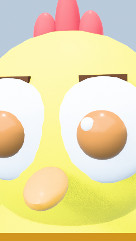

### proposed upgrade — proposed_upgrade_goat_closeup.png

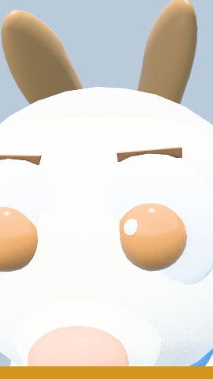

### proposed upgrade — proposed_upgrade_pip_full_body.png

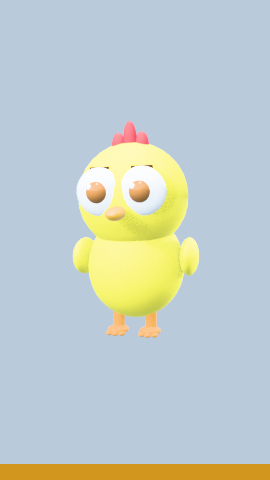

### proposed upgrade — proposed_upgrade_goat_full_body.png

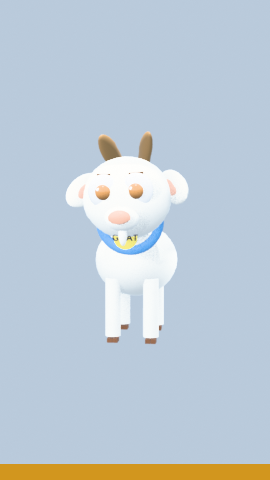

### proposed upgrade — proposed_upgrade_pip_closeup_motivated.png

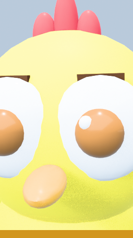

### proposed upgrade — proposed_upgrade_goat_closeup_motivated.png

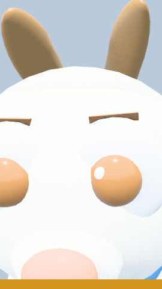

### proposed upgrade — proposed_upgrade_meadow_set.png

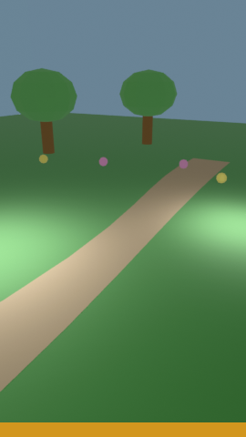

### proposed upgrade — proposed_upgrade_map_prop.png

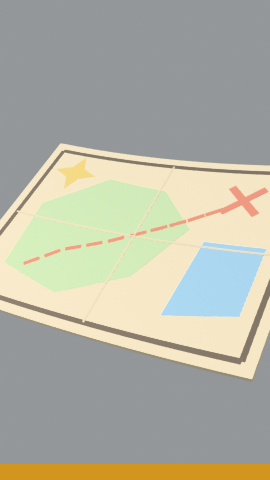

### proposed upgrade — proposed_upgrade_vertical_scene_meadow.png

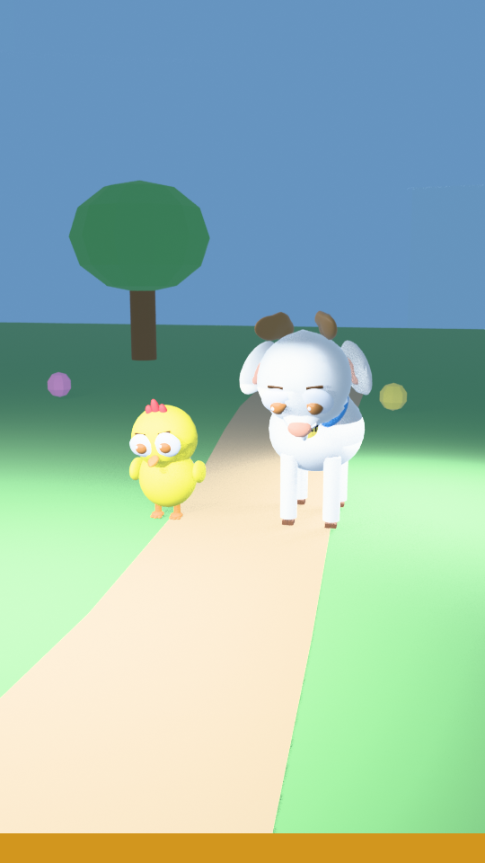

### temporary diagnostic asset — diagnostic_pip_front.png

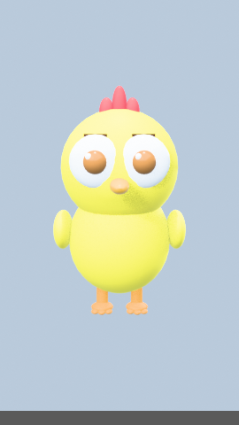

